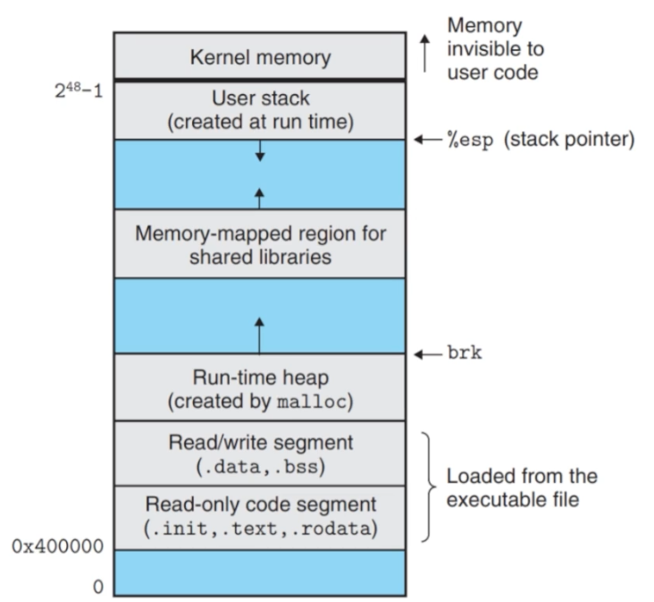

# Memory
## Virtual Memory vs. Physical memory`
- **virtual address**
  - a logical address translated to a physical address at runtime
  - Virtual memory hides **physical memory fragmentation** from processes.
    - ```
      Fragmentation = memory becomes broken into unusable gaps, also called "holes".
      
      Imagine physical memory:
        [ Process A ][ free - 20MB ][ Process B ][ free - 30MB ][ Process C ][ free - 50MB ]
      A new process needs one continuous 70MB block:
        [  70MB continuous  ]
      
      Total free memory might be enough (free = 20 + 30 + 50 = 100 MB).
      But, the OS cannot place it, because the biggest single hole is only 50MB.
      ```
    - ```
      Paging = Split memory into fixed-size blocks.
      
      Virtual memory is split into:
        [ Virtual Page 0 ][ Virtual Page 1 ][ Virtual Page 2 ][ Virtual Page 3 ]
      Physical memory is split into same-size blocks called frames:
        [ Frame 0 ][ Frame 1 ][ Frame 2 ][ Frame 3 ][ Frame 4 ][ Frame 5 ]
      The OS keeps a page table:
        Virtual Page 0  ->  Frame 4
        Virtual Page 1  ->  Frame 1
        Virtual Page 2  ->  Frame 5
        Virtual Page 3  ->  Frame 0
      ```
    - ```
      With paging and virtual addresses, the new process can use the remaining 100 MB of fragmented memory.
      ```
- **physical address**
  - the address of piece of memory physically in RAM

<br>

---

<br>



<br>

---

<br>

```bash
# /proc: is a virtual filesystem provided by the Linux kernel.
#     - /proc/cpuinfo      CPU information
#     - /proc/meminfo      memory information
#     - /proc/uptime       system uptime
#     - /proc/<pid>/       information about one process
# /proc/self: the /proc/<pid> directory of the process that is currently accessing it
#     - /proc/self/ ---self: current-accessing-pid---> /porc/<current process's pid>/
# /proc/self/maps: maps is a file that shows the virtual memory mappings of a process.
#     - cat /proc/self/maps -> print the virtual memory layout of the cat process
hiddenlotus@TUF-TX-FA608PM:~/Desktop/temp$ cat /proc/self/maps 
# Program code segment
5fdf3f7f1000-5fdf3f7f3000 r--p 00000000 103:06 1704527                   /usr/bin/cat
5fdf3f7f3000-5fdf3f7f8000 r-xp 00002000 103:06 1704527                   /usr/bin/cat
5fdf3f7f8000-5fdf3f7fa000 r--p 00007000 103:06 1704527                   /usr/bin/cat
5fdf3f7fa000-5fdf3f7fb000 r--p 00008000 103:06 1704527                   /usr/bin/cat
5fdf3f7fb000-5fdf3f7fc000 rw-p 00009000 103:06 1704527                   /usr/bin/cat
# Heap
5fdf5f6c5000-5fdf5f6e6000 rw-p 00000000 00:00 0                          [heap]
# Locale archive
# It contains locale data, like: language settings, language settings, date/time formatting, and sorting rules
7e4ed2200000-7e4ed2775000 r--p 00000000 103:06 1704016                   /usr/lib/locale/locale-archive
# Memory-mapped shared libraries
7e4ed2800000-7e4ed2828000 r--p 00000000 103:06 1727019                   /usr/lib/x86_64-linux-gnu/libc.so.6
7e4ed2828000-7e4ed29b0000 r-xp 00028000 103:06 1727019                   /usr/lib/x86_64-linux-gnu/libc.so.6
7e4ed29b0000-7e4ed29ff000 r--p 001b0000 103:06 1727019                   /usr/lib/x86_64-linux-gnu/libc.so.6
7e4ed29ff000-7e4ed2a03000 r--p 001fe000 103:06 1727019                   /usr/lib/x86_64-linux-gnu/libc.so.6
7e4ed2a03000-7e4ed2a05000 rw-p 00202000 103:06 1727019                   /usr/lib/x86_64-linux-gnu/libc.so.6
7e4ed2a05000-7e4ed2a12000 rw-p 00000000 00:00 0 
7e4ed2aad000-7e4ed2ad2000 rw-p 00000000 00:00 0 
7e4ed2ae5000-7e4ed2ae7000 rw-p 00000000 00:00 0 
# vvar, vvar_vclock, vdsof: special kernal provided mappings
7e4ed2ae7000-7e4ed2ae9000 r--p 00000000 00:00 0                          [vvar]
7e4ed2ae9000-7e4ed2aeb000 r--p 00000000 00:00 0                          [vvar_vclock]
7e4ed2aeb000-7e4ed2aed000 r-xp 00000000 00:00 0                          [vdso]
# Memory-mapped shared libraries
7e4ed2aed000-7e4ed2aee000 r--p 00000000 103:06 1726845                   /usr/lib/x86_64-linux-gnu/ld-linux-x86-64.so.2
7e4ed2aee000-7e4ed2b19000 r-xp 00001000 103:06 1726845                   /usr/lib/x86_64-linux-gnu/ld-linux-x86-64.so.2
7e4ed2b19000-7e4ed2b23000 r--p 0002c000 103:06 1726845                   /usr/lib/x86_64-linux-gnu/ld-linux-x86-64.so.2
7e4ed2b23000-7e4ed2b25000 r--p 00036000 103:06 1726845                   /usr/lib/x86_64-linux-gnu/ld-linux-x86-64.so.2
7e4ed2b25000-7e4ed2b27000 rw-p 00038000 103:06 1726845                   /usr/lib/x86_64-linux-gnu/ld-linux-x86-64.so.2
# Stack
7ffc139b4000-7ffc139d6000 rw-p 00000000 00:00 0                          [stack]
ffffffffff600000-ffffffffff601000 --xp 00000000 00:00 0                  [vsyscall]
```